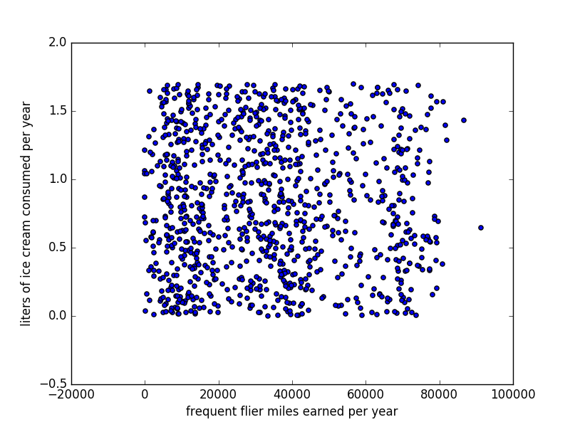
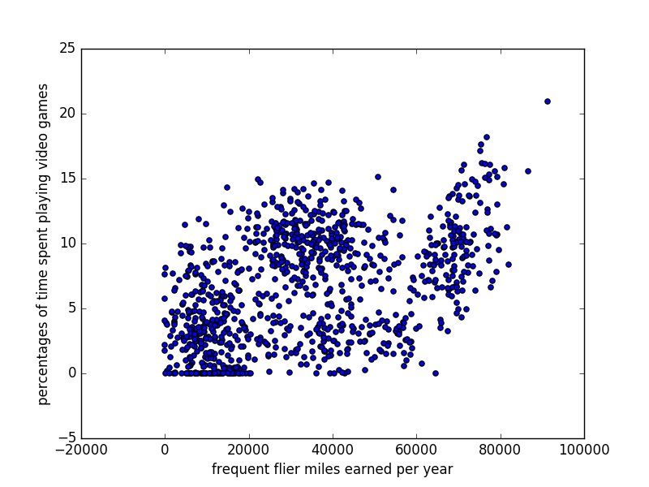
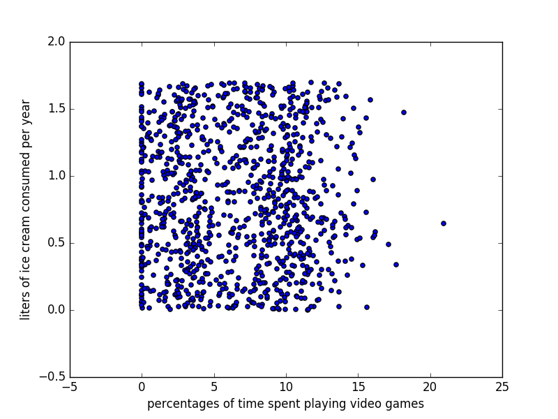

# 使用k近邻值算法改进约会网站的配对效果

(1) 收集数据：默认提供在文件里面的数据来源

(2) 准备数据：使用Python解析文本文件knn中的file2matrix 函数来实现

(3) 分析数据：绘制各种散点图，见下图

(4) 训练算法：无

(5) 测试算法：测试的数据来源见文件

(6) 使用算法：简单的控制台交互。或者把数据按一定规律放到test_data.txt文件里面

## 文件
学习的数据来源于: [datingTestSet.txt](./datingTestSet.txt)

测试的数据来源于: [test_data.txt](./test_data.txt)

测试的结果存储于: [result.txt](./result.txt)

## 绘制的散点图如下

